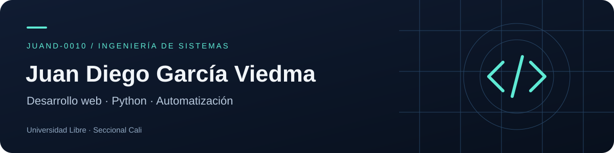

[Proyectos](#proyectos-destacados) · [Tecnologías](#tecnologías) · [English](#english) · [LinkedIn](https://www.linkedin.com/in/juan-viedma/) · [Correo](mailto:juanviedma9@gmail.com)

# Juan Diego García Viedma

Estudio Ingeniería de Sistemas en la **Universidad Libre, Seccional Cali**. Me interesa construir aplicaciones web, herramientas en Python y automatizaciones que resuelvan tareas concretas.

Aquí comparto proyectos personales y académicos: interfaces con React y JavaScript, flujos de compra simulados y procesamiento de documentos. También exploro el desarrollo backend, Android y el uso de IA en los procesos de trabajo.

## Proyectos destacados

### Twitch Portfolio — React y Vite

Presentación de un canal dedicado a rompecabezas 3D y videojuegos. Incluye navegación por secciones, diseño adaptable y publicación automática con GitHub Actions.

**[Ver demo](https://juand-0010.github.io/twitch-portfolio-react/)** · [Explorar código](https://github.com/Juand-0010/twitch-portfolio-react)

### Brasa Norte — HTML, CSS y JavaScript

Prototipo de una web de restaurante con menú por categorías, carrito con cantidades y persistencia en el navegador. Calcula subtotal, envío y total e incluye un flujo de pedido simulado.

[Explorar código](https://github.com/Juand-0010/restaurante-web)

### Contador de palabras y vocales en PDF — Python

Herramienta de consola para leer documentos PDF, buscar palabras y contar vocales seleccionadas. Usa PyPDF2 y reúne los resultados en una matriz.

[Explorar código](https://github.com/Juand-0010/contador-pdf-python)

[Ver todos mis repositorios](https://github.com/Juand-0010?tab=repositories)

## Tecnologías

| Área | Herramientas |
| --- | --- |
| Proyectos destacados | React, Vite, JavaScript, HTML, CSS, Python, PyPDF2 |
| Backend que exploro | Node.js, APIs REST, .NET / C#, Laravel |
| Desarrollo móvil que exploro | Kotlin, Java, Android Studio, fundamentos de MVVM |
| Datos y herramientas | MySQL, MongoDB, Git, GitHub, Linux, VS Code |

## En qué estoy profundizando

Me interesa conectar lo que aprendo con proyectos que se puedan ejecutar y revisar: arquitectura backend, automatización con Python, fundamentos de cloud y DevOps, y desarrollo seguro. También estoy explorando flujos de datos y herramientas de IA.

## Contacto

Puedes escribirme sobre los proyectos o intercambiar ideas de desarrollo.

[juanviedma9@gmail.com](mailto:juanviedma9@gmail.com) · [LinkedIn](https://www.linkedin.com/in/juan-viedma/)

## English

About me and selected projects

I am a Systems Engineering student at Universidad Libre, Cali campus. I build personal and academic projects with JavaScript, React and Python, and explore backend development, Android and automation.

- **[Twitch Portfolio](https://github.com/Juand-0010/twitch-portfolio-react):** a responsive React and Vite website with automated GitHub Pages deployment. [Live demo](https://juand-0010.github.io/twitch-portfolio-react/).
- **[Brasa Norte](https://github.com/Juand-0010/restaurante-web):** a restaurant website prototype with category filters, a persistent shopping cart and a simulated ordering flow.
- **[PDF word and vowel counter](https://github.com/Juand-0010/contador-pdf-python):** a Python console tool using PyPDF2 to analyze text from PDF documents.

[Email](mailto:juanviedma9@gmail.com) · [LinkedIn](https://www.linkedin.com/in/juan-viedma/)

